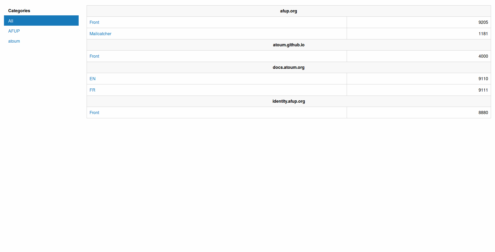

# baboard

A dashbard for your docker-compose dev environment.

## Features

A simple listing of the projets curently running locally in order to open them easily.

Each service that have a port binding with a name. They will be grouped by projet and category.

Here is an example of what it looks like ;



## Install it

### Via docker

Run :
```
docker run 
```

## Use it

### baboard.container.disabled

`boolean` : do not display the service on baboard.

### baboard.container.name

`string` : service name. Defaults to ``. Examples : `Mailcatcher`, `Front`, `Back`, `FR`, `EN`, `Redis Commander`.
 
If you have an hostname based application running in your container (that's not a good practice), you can indicate the host used to access the container by prefixing the name by the hostname followed by a colon. For example : `myhostname:Website`.

If you have multiple hostname based applications running in your container (that's not a good practice), you can indicate them by separating them with a coma. For example : `myhostname:Website 1,mysecondhostname:Website 2`.

### baboard.project.name

`string` : project name. Defaults to ``. Examples : `atoum website`, `atoum documentation`, `afup.org`, `aperophp.net`, `myProject`. 

### baboard.project.category

`string` : category name. By defaut, the container does not have a category. Examples `atoum`, `afup`, `myCompagny`.

### baboard.container.default_path

`string` : path that will be added to the container url. Defaults to none. Examples : `/app_dev.php`, `/_plugin/head`.
 

## Launch it at startup

See also [https://docs.docker.com/engine/admin/host_integration/](https://docs.docker.com/engine/admin/host_integration/)

### With upstart

Create a file in the upstart directory, for example : `/etc/init/docker-baboard.conf`.

```
description "Baboard container"
author "Me"
start on filesystem and started docker
stop on runlevel [!2345]
respawn
script
  /usr/bin/docker run -v /var/run/docker.sock:/var/run/docker.sock -p 80:80 agallou/baboard
end script
```

Then `sudo service docker-baboard start` to tun it the first time.

## License

baboard is released under the MIT License. See the bundled LICENSE file for details.

